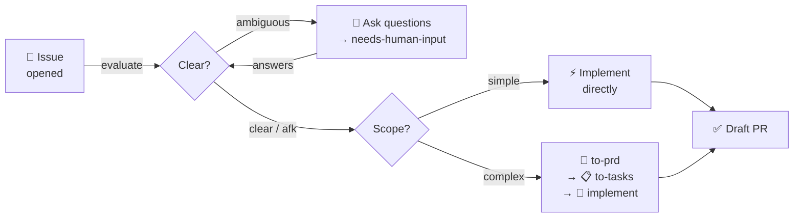
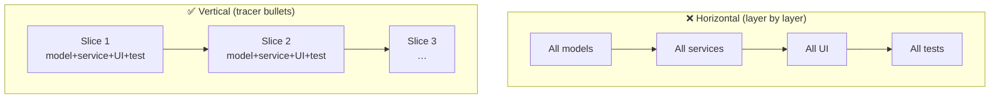
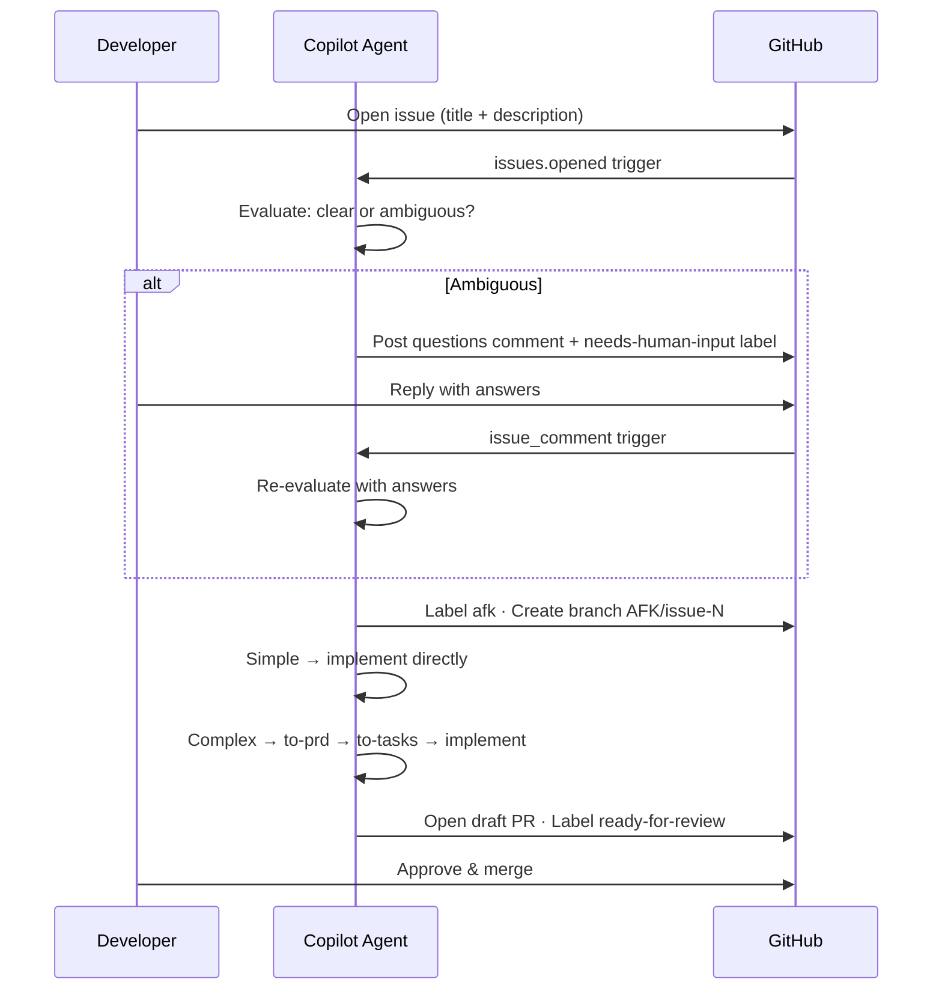

# issue-automate

## From Issue to Implementation

<div class="mt-8 max-w-2xl text-left text-lg leading-8 text-slate-300">
  A Copilot workflow that classifies, plans, and ships issues autonomously —<br>
  or asks exactly what it needs before proceeding.
</div>

<div class="mt-10 grid gap-4 grid-cols-4">
  <div class="rounded-2xl border border-violet-400/20 bg-violet-400/10 p-4">
    <div class="text-xs uppercase tracking-widest text-violet-300">Step 1</div>
    <div class="mt-2 font-semibold">Issue opened</div>
  </div>
  <div class="rounded-2xl border border-amber-400/20 bg-amber-400/10 p-4">
    <div class="text-xs uppercase tracking-widest text-amber-300">Step 2</div>
    <div class="mt-2 font-semibold">Ambiguity check</div>
  </div>
  <div class="rounded-2xl border border-cyan-400/20 bg-cyan-400/10 p-4">
    <div class="text-xs uppercase tracking-widest text-cyan-300">Step 3</div>
    <div class="mt-2 font-semibold">Classify &amp; implement</div>
  </div>
  <div class="rounded-2xl border border-emerald-400/20 bg-emerald-400/10 p-4">
    <div class="text-xs uppercase tracking-widest text-emerald-300">Step 4</div>
    <div class="mt-2 font-semibold">Draft PR</div>
  </div>
</div>

---

# The Problem

<div class="grid gap-6 grid-cols-2 mt-4">
<div class="rounded-2xl border border-rose-400/20 bg-rose-400/10 p-6">

## Without automation

- Agent requires a perfectly-written prompt
- Ambiguous issues silently produce wrong code
- Sub-issues multiply; hard to track status
- Human must manually assign slices to agents

</div>
<div class="rounded-2xl border border-emerald-400/20 bg-emerald-400/10 p-6">

## With issue-automate

- Open an issue; the agent decides what to do
- Ambiguous? It asks — in one comment
- No sub-issues; one draft PR per issue
- to-prd + to-tasks invoked automatically for complex work

</div>
</div>

---

# The Pipeline



<div class="mt-4 text-sm text-slate-300">
  PRD and tasks files are committed to the branch as plain markdown — no external trackers, no sub-issues.
</div>

---

# to-prd: What it does

<div class="grid gap-6 grid-cols-2">
<div>

**Invoke with:** `@to-prd`

Copilot reads the conversation and repo, then writes `PRD-<topic>.md` with:

- **Problem Statement** — from the user's perspective
- **Solution** — high-level answer
- **User Stories** — exhaustive numbered list
- **Implementation Decisions** — modules, interfaces, schemas
- **Testing Decisions** — what to test and how
- **Out of Scope** — explicit exclusions

</div>
<div class="rounded-2xl border border-white/10 bg-slate-900/60 p-5 text-sm font-mono">

```md
## Problem Statement

Users must rebuild the same workout
draft by hand every week.

## User Stories

1. As a gym user, I want to save a
   completed workout as a template…
2. As a gym user, I want to load a
   template into a new draft…

## Implementation Decisions

- Introduce a WorkoutTemplate model
- Separate localStorage key from workouts
- Template catalog service as deep module
```

</div>
</div>

---

# to-tasks: What it does

<div class="grid gap-6 grid-cols-2">
<div>

**Invoke with:** `@to-tasks`

Reads the PRD, then writes `tasks-<topic>.md` where each task is a **vertical tracer-bullet slice**:

- Thin but complete — all layers end-to-end
- **AFK** — agent can ship autonomously
- **HITL** — needs a human decision
- `Blocked by` — explicit dependency graph
- Acceptance criteria as checkboxes

</div>
<div class="rounded-2xl border border-white/10 bg-slate-900/60 p-5 text-sm font-mono">

```md
## WT-1 Save Completed Workout As Template

Type: AFK
Blocked by: None

Acceptance criteria:

- [ ] Save from history persists template
- [ ] Blank names are rejected
- [ ] Reload restores templates

## WT-2 Load Template Into New Workout

Type: AFK
Blocked by: WT-1
```

</div>
</div>

---

# Vertical vs. Horizontal Slices



<div class="mt-6 grid gap-4 grid-cols-2 text-sm text-slate-300">
  <div class="rounded-xl border border-rose-400/20 bg-rose-400/10 p-3">Horizontal: nothing demoable until all layers are done.</div>
  <div class="rounded-xl border border-emerald-400/20 bg-emerald-400/10 p-3">Vertical: each slice is independently shippable and verifiable.</div>
</div>

---

# TypeScript Example: Task shape

```ts
type SliceType = 'AFK' | 'HITL';

interface TaskSlice {
  id: string; // e.g. "WT-1"
  title: string;
  type: SliceType;
  parentDoc: string; // PRD-*.md reference
  whatToBuild: string; // end-to-end behavior description
  acceptanceCriteria: string[];
  blockedBy: string[]; // task IDs, empty if none
}

// Example slice from the gym-tracker PRD
const saveTemplateSlice: TaskSlice = {
  id: 'WT-1',
  title: 'Save Completed Workout As Template',
  type: 'AFK',
  parentDoc: 'PRD-workout-templates.md',
  whatToBuild: 'End-to-end path: history → name input → persist template → reload',
  acceptanceCriteria: [
    'Save from history writes to localStorage',
    'Blank names are rejected with visible error',
    'Reload restores saved templates',
  ],
  blockedBy: [],
};
```

---

# TypeScript Example: PRD module shape

```ts
interface DeepModule<TInput, TOutput> {
  // Small surface, large encapsulated behavior
  execute(input: TInput): Promise<TOutput>;
}

// PRD implementation decision: template catalog as deep module
interface WorkoutTemplateCatalog {
  list(): WorkoutTemplate[];
  createFromWorkout(workout: Workout, name: string): WorkoutTemplate;
  rename(id: string, newName: string): void;
  delete(id: string): void;
}

// PRD testing decision: test at the service boundary, not internals
describe('WorkoutTemplateCatalog', () => {
  it('persists a new template and restores it after reload', () => {
    const catalog = new WorkoutTemplateCatalogService(new LocalStorageAdapter());
    catalog.createFromWorkout(completedWorkout, 'Push Day A');
    const restored = new WorkoutTemplateCatalogService(new LocalStorageAdapter());
    expect(restored.list()).toHaveLength(1);
  });
});
```

---

# GitHub Agentic Workflow



<div class="mt-4 grid gap-3 grid-cols-3 text-sm text-slate-300">
  <div class="rounded-xl border border-violet-400/20 bg-violet-400/10 p-3"><strong class="text-violet-300">Clarify</strong> — all questions in one comment; model re-evaluates after each reply</div>
  <div class="rounded-xl border border-cyan-400/20 bg-cyan-400/10 p-3"><strong class="text-cyan-300">Implement</strong> — simple issues go direct; complex use to-prd → to-tasks</div>
  <div class="rounded-xl border border-emerald-400/20 bg-emerald-400/10 p-3"><strong class="text-emerald-300">Review</strong> — one draft PR per issue; human approves and merges</div>
</div>

---

# GitHub Agentic Workflow: Prompt Helper

```ts
type IssueVerdict = 'afk' | 'needs-human-input';
type IssueComplexity = 'simple-task' | 'complex-task';

interface IssueClassification {
  verdict: IssueVerdict;
  complexity?: IssueComplexity; // set when verdict is 'afk'
  questions?: string[]; // set when verdict is 'needs-human-input'
}

// Complex issue → workflow runs to-prd → to-tasks → implement
const complex: IssueClassification = {
  verdict: 'afk',
  complexity: 'complex-task',
};

// Ambiguous issue → workflow posts questions and waits
const ambiguous: IssueClassification = {
  verdict: 'needs-human-input',
  questions: [
    '1. Should templates be editable after creation, or read-only?',
    '2. Which storage backend: localStorage only, or also cloud sync?',
  ],
};
```

<div class="mt-3 grid gap-3 grid-cols-3 text-sm text-slate-300">
  <div class="rounded-xl border border-white/10 bg-white/5 p-3">One comment, all questions — never multiple rounds of single questions</div>
  <div class="rounded-xl border border-white/10 bg-white/5 p-3">Model re-evaluates after each human reply; can follow up if still unclear</div>
  <div class="rounded-xl border border-white/10 bg-white/5 p-3">Human adds <code>afk</code> label to force-skip the ambiguity check</div>
</div>

---

# Key Rules

<div class="grid gap-5 grid-cols-3 mt-4">

<div class="rounded-2xl border border-violet-400/20 bg-violet-400/10 p-5">

**issue-automate**

- All questions in one comment
- No sub-issues — ever
- `afk` label bypasses ambiguity
- One draft PR per issue

</div>

<div class="rounded-2xl border border-cyan-400/20 bg-cyan-400/10 p-5">

**to-prd / to-tasks**

- Synthesize, don’t interview
- Vertical slices only
- Each slice is demoable
- No file paths in decisions

</div>

<div class="rounded-2xl border border-emerald-400/20 bg-emerald-400/10 p-5">

**Both**

- Local markdown artifacts
- No external trackers
- Don’t modify PRD from tasks
- ADRs > assumptions

</div>

</div>

---

# Takeaway

<div class="max-w-3xl text-xl leading-9 text-slate-200">
  <code class="text-violet-300">issue-automate</code> classifies and plans.<br>
  <code class="text-cyan-300">to-prd</code> + <code class="text-emerald-300">to-tasks</code> make complex work executable.<br>
  Together they let you open an issue and get a draft PR — no manual prompting required.
</div>

<div class="mt-10 grid gap-4 grid-cols-2 text-sm text-slate-400">
  <div class="rounded-xl border border-white/10 p-4">Write clear issues — or let the agent ask you what it needs.</div>
  <div class="rounded-xl border border-white/10 p-4">Add the <code>afk</code> label to trust the agent immediately and skip the check.</div>
</div>
